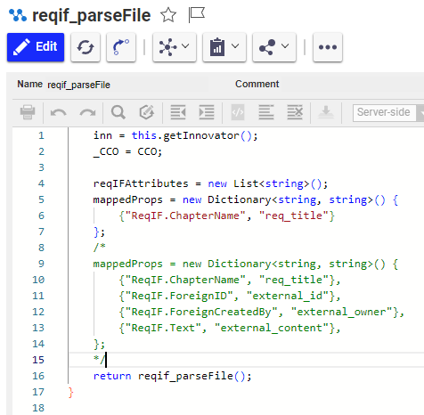

# ReqIF Import in Requirement Engineering

## Use Case 1: Import new ReqIf/Reqifz file in ARAS

In order to import a ReqIf file in RE, please got into the TOC -> Requirements -> Create new Requirement

Then you'll need to select which file you want to import

Once open is clicked, please wait until the import is finished. Once done, the Requirement Document will automatically open. 

## Use Case 2: Map custom ReqIf Property to ARAS Requirement properties

If you have custom Attributes into your ReqIF file that you want to map in ARAS, you have on the Requirement Document a TAB "ReqIF Properties". In this TAB, all custom ReqIf Attribute will appear, and you can map them to ARAS Requirement properties.

Once your mapping is done, save the Requirement Document and go into menu Action and click on "Map ReqIF Attribute to Reqs". This will regenerate the Requirement Document and use the properties that you mapped. 

## Use Case 3: Update Parser mapping

If you need to modify the Parser that is creating the Requirements during the Import, please edit the method: **reqif_parseFile**

In the first lines, you can determine which property of your ReqIf file will be mapped to which property of ARAS@Requirement

You'll then have to modify the Schema to tell ARAS how to present them. Please open the Document Type "RE-Standard" which is use for Requirement Engineering. 

TOC -> Technical Documentation -> Document Types and search for RE-Standard

When you create a node, make sure it exists in the Schema.

