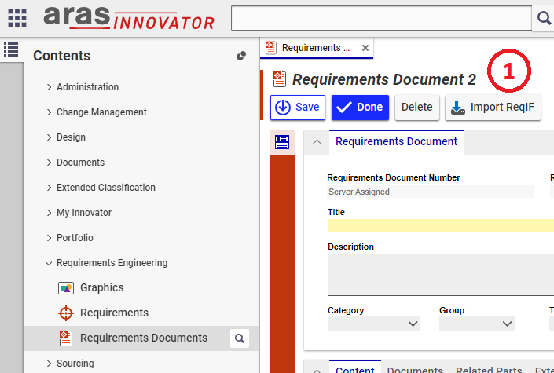

# ReqIF Import in Tech Doc (TD)

## Use Case 1: Import new ReqIf/Reqifz file in ARAS

To avoid confusion in usage of ARAS Properly, the action is only available for user "root", so if you don't see the "Import ReqIF" button, please login as root or change the "For Identity" on CUI button: "reqif_TDF_import" in commandbarSection: "reqif_tdf_custom_buttons"

In order to import a ReqIf file in TD, please got into the TOC -> Technical Documentation -> Create new Technical Document

Select a reqif or reqifz file

Once open is clicked, please wait until the import is finished. Once done, the Tech Doc will automatically open. 

## Use Case 2: Modify the mapping of the parser

Please have a look at the documentation of RE, it is built following the same logic and code for mapping is duplicated.

[RE Documentation here](./User_Guide_RE.md)